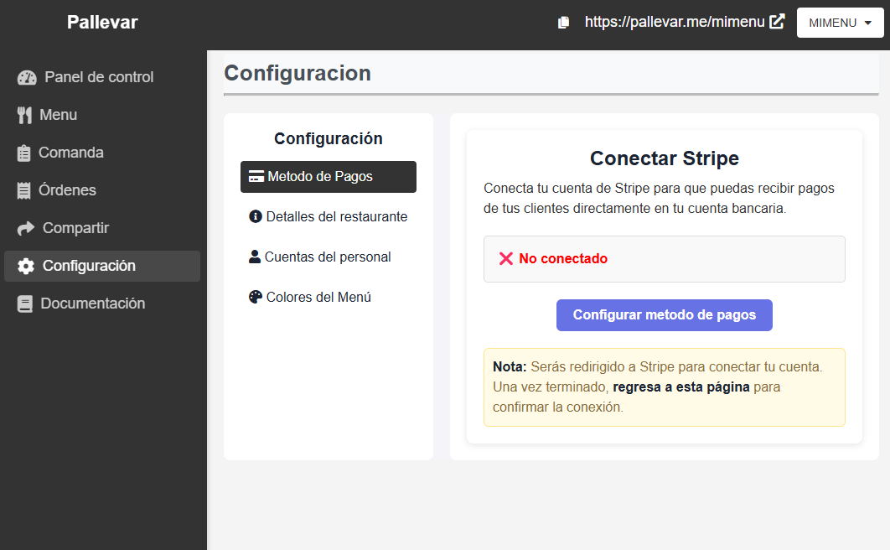
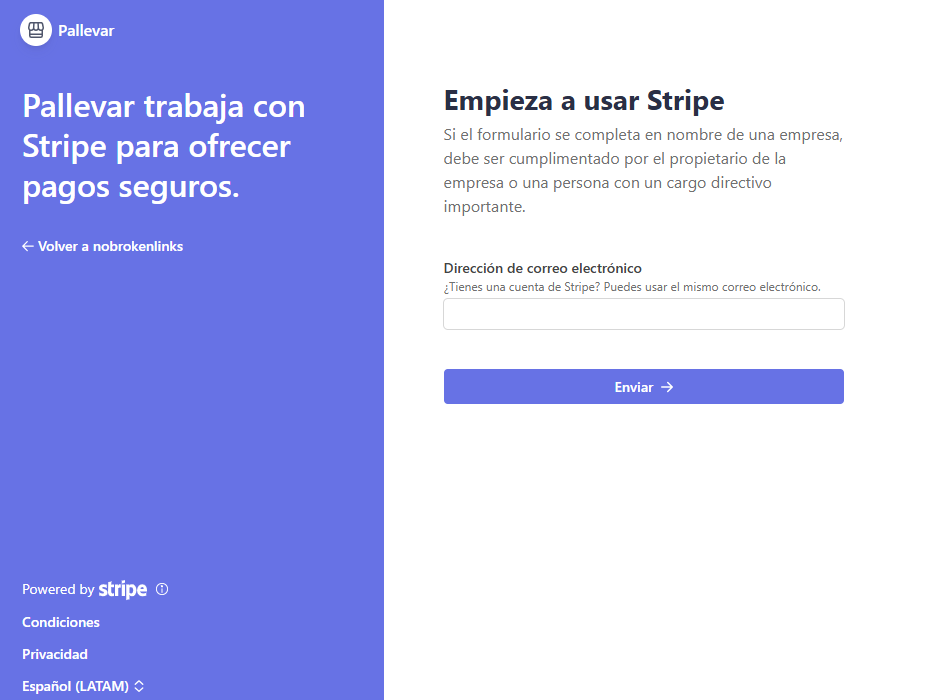

# Configuración de Métodos de Pago

En esta sección, te mostraremos cómo configurar los métodos de pago en Pallevar. Esto te permitirá recibir pagos de tus clientes de forma segura y rápida.

### ¿Qué plataforma utilizamos para procesar los pagos?
Para gestionar los pagos, utilizamos [**Stripe**](https://stripe.com/en-mx), una plataforma global segura y confiable que permite aceptar pagos con tarjetas de crédito, débito y otros métodos de pago digitales. Stripe cumple con los más altos estándares de seguridad, por lo que puedes estar tranquilo al procesar los pagos de tus clientes.

No necesitas conocimientos técnicos para comenzar, simplemente sigue estos pasos para conectar tu cuenta. 🎉

---

## **Pasos para configurar tus métodos de pago**

### **1. Accede a tu Panel Administrativo**
   - Inicia sesión en tu cuenta de [**Pallevar**](https://admin.espallevar.com/).  
   - Ve a la sección de **Configuración** > [**Metodo de Pagos**](https://admin.espallevar.com/configuracion).

---

### **2. Haz clic en "Configurar Métodos de Pago"**
   - En la página de configuración de pagos, encontrarás el botón **"Configurar metodo de pagos"**.  
        
    
   - Haz clic en este botón **"Configurar metodo de pagos"** para iniciar el proceso.
        
---

### **3. Conecta tu cuenta de Stripe**
:::info
Recuerda que debes utilizar la misma cuenta de correo electronico con la cual te registraste en **Pallevar**
:::
   - Serás redirigido a una página segura proporcionada por **Stripe**.  
   
   - Aquí tendrás dos opciones:
     1. **Crear una nueva cuenta de Stripe**: Si no tienes una cuenta de Stripe, puedes crearla fácilmente siguiendo las instrucciones.  
     2. **Iniciar sesión en Stripe**: Si ya tienes una cuenta de Stripe, solo ingresa tus credenciales.

---

### **4. Completa el formulario de Stripe**
   - Stripe te pedirá algunos datos para configurar tu cuenta:
     - Información de tu negocio (nombre, dirección, etc.).  
     - Datos de contacto (correo, teléfono).  
     - Tu cuenta bancaria, para que puedas recibir pagos.  

   - **Nota:** Toda la información se gestiona directamente en Stripe de manera segura.

---

### **5. Regresa a tu Panel Administrativo**
   - Una vez completada la configuración en Stripe, serás redirigido automáticamente al **Panel Administrativo de Pallevar**.  
   - Verás un mensaje indicando que tus métodos de pago están configurados correctamente.

---

## **¿Qué hacer después de configurar Stripe?**
- ¡Listo! Ahora puedes comenzar a recibir pagos de tus clientes directamente a través de **Pallevar**.  
- Si necesitas verificar o actualizar tu configuración de pagos, siempre puedes regresar a la sección de configuración en tu panel.

---

## **Preguntas Frecuentes**

### **¿Qué es Stripe y por qué lo utilizamos?**
Stripe es una plataforma de pagos reconocida internacionalmente que permite a negocios aceptar pagos en línea de forma segura y confiable. Hemos integrado Stripe en Pallevar para que no tengas que preocuparte por los aspectos técnicos o de seguridad del manejo de pagos.

### **¿Es obligatorio tener una cuenta de Stripe?**
Sí, para recibir pagos necesitas vincular una cuenta de Stripe. El proceso es rápido y seguro.

### **¿Qué pasa si no tengo una cuenta de Stripe?**
No te preocupes, Stripe te permite crear una cuenta durante el proceso de conexión. Solo sigue las instrucciones.

### **¿Es seguro usar Stripe?**
Sí, Stripe cumple con estándares de seguridad muy estrictos, como **PCI DSS**, que protege toda la información de tus clientes y transacciones.

### **¿Qué hago si la conexión falla?**
Si experimentas problemas al conectar tu cuenta, asegúrate de que tu conexión a internet esté funcionando y que hayas ingresado la información correctamente. Si el problema persiste, contáctanos para recibir ayuda.

---

## 🎥 **Video Tutorial**  
Pronto publicaremos un video donde explicamos este proceso paso a paso. ¡Mantente atento!
