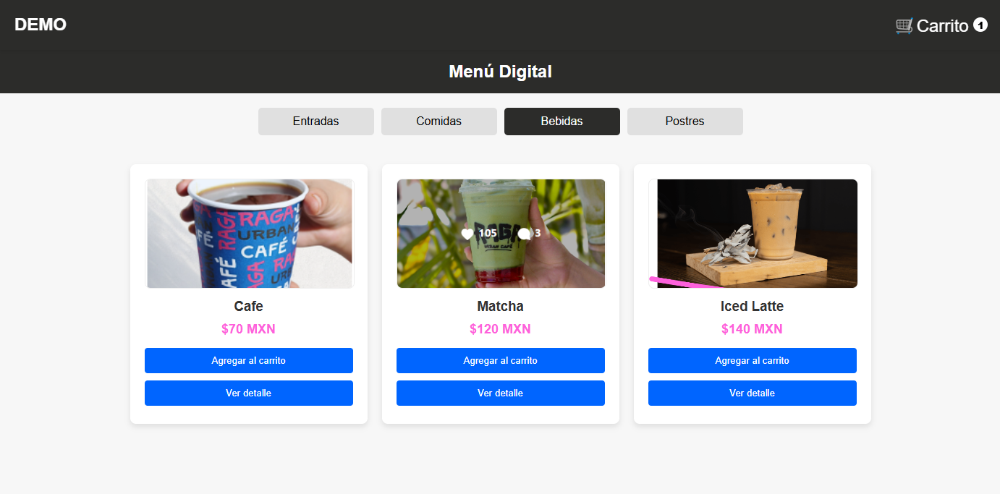

# Cómo navegar por el menú digital

El Menú Digital de Pallevar está diseñado para ofrecer una experiencia intuitiva y sencilla tanto para los restaurantes como para sus clientes. Esta guía te mostrará paso a paso cómo navegar por el menú digital y sacar el máximo provecho de sus funcionalidades.

## Acceso al Menú Digital

1. **Enlace directo**: Los clientes pueden acceder al menú a través de un enlace único proporcionado por el restaurante, como [pallevar.me/demo](https://pallevar.me/demo).
2. **Códigos QR**: Muchos restaurantes generan códigos QR que enlazan directamente al menú. Solo necesitas escanear el código con la cámara de tu teléfono.

## Explorando el Menú

El menú está estructurado para facilitar la navegación:

### 1. **Categorías de productos**

- Las categorías están visibles en la parte superior del menú.
    
- Ejemplos de categorías incluyen:
  - Entradas
  - Platos fuertes
  - Postres
  - Bebidas

Haz clic en una categoría para explorar los productos disponibles.

### 2. **Detalles del producto**

- Cada producto incluye:
  - **Nombre**: Título descriptivo del platillo o bebida.
  - **Precio**: El costo de cada producto.
  - **Descripción**: Información sobre los ingredientes o características destacadas.
  - **Imagen** (si el restaurante la ha agregado): Una foto que ilustra el producto.

## Creando un Pedido

1. **Selecciona un producto**:
   - Haz clic en el producto que deseas.
   - Ajusta la cantidad si es necesario.
   - Presiona el botón **Agregar al carrito**.

2. **Visualiza tu carrito**:
   - Haz clic en el ícono del carrito, generalmente ubicado en la parte superior derecha.
   - Revisa los productos seleccionados, cantidades y el total.

3. **Confirma tu pedido**:
   - Presiona el botón **Procesar Pedido**.
   - Selecciona las opciones de recogida (e.g., "Recoger en tienda").
   - Proporciona los datos requeridos, como tu nombre o preferencia de pago.

## Opciones de Personalización

Algunos restaurantes permiten personalizar los productos:

- **Ingredientes opcionales**: Puedes agregar o eliminar ingredientes según tu preferencia.
- **Notas especiales**: Utiliza la sección de comentarios para indicar alergias, preferencias de cocción o cualquier detalle adicional.

## Beneficios de Navegar por el Menú Digital

- **Facilidad de uso**: Una interfaz simple que permite realizar pedidos en minutos.
- **Transparencia**: Los precios y descripciones son claros, lo que evita confusiones.
- **Ahorro de tiempo**: Los clientes pueden explorar y decidir su pedido sin prisas.

El Menú Digital de Pallevar está pensado para optimizar la experiencia de los usuarios y ayudar a los restaurantes a gestionar sus pedidos de forma eficiente. Navegar por él es intuitivo y ofrece todas las herramientas necesarias para un proceso de pedido cómodo y rápido.

¡Explora tu Menú Digital hoy y descubre lo fácil que es disfrutar de tus platillos favoritos con Pallevar!

